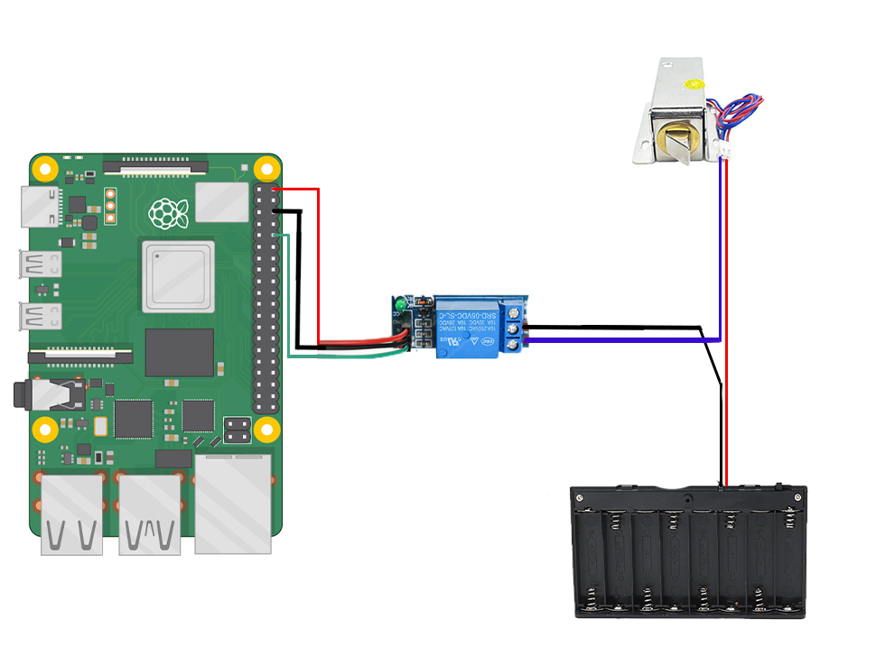
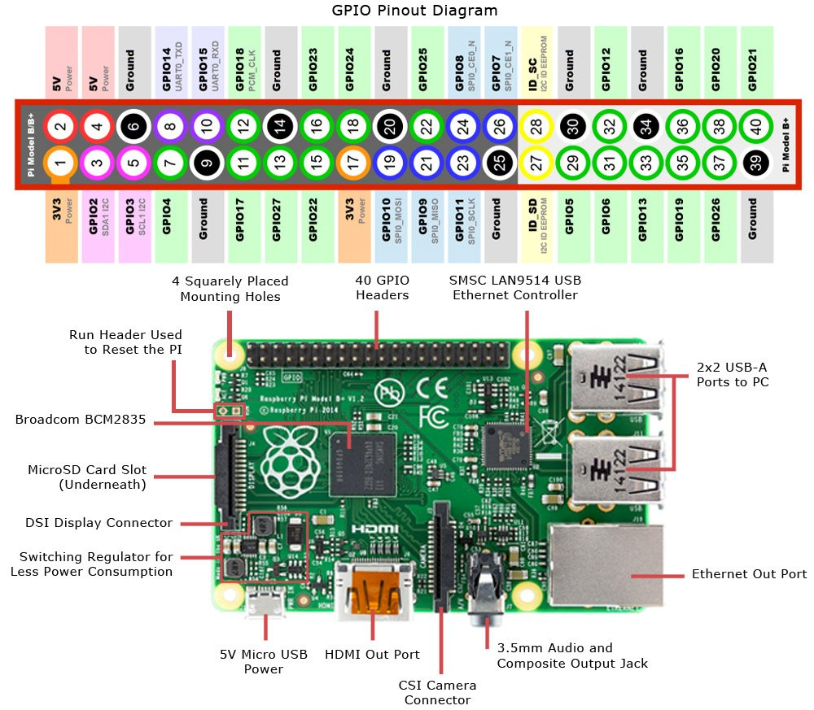

# AWS IoT Python Implementation  

## Replace the following  
certs folder  
Define ENDPOINT, CLIENT_ID, PATH_TO_CERT, PATH_TO_KEY and PATH_TO_ROOT  

References: https://aws.amazon.com/premiumsupport/knowledge-center/iot-core-publish-mqtt-messages-python/  

# Guide for Raspberry Pi 4 Solenoid Lock-style 12v with Single Relay Module  
    
## Solenoid Lock and Relay Module Diagram  
Red Wire: 5v  
Black Wire: Ground  
Green Wire: Pin 18  
  

## Raspberry Pi 4 Diagram  
  